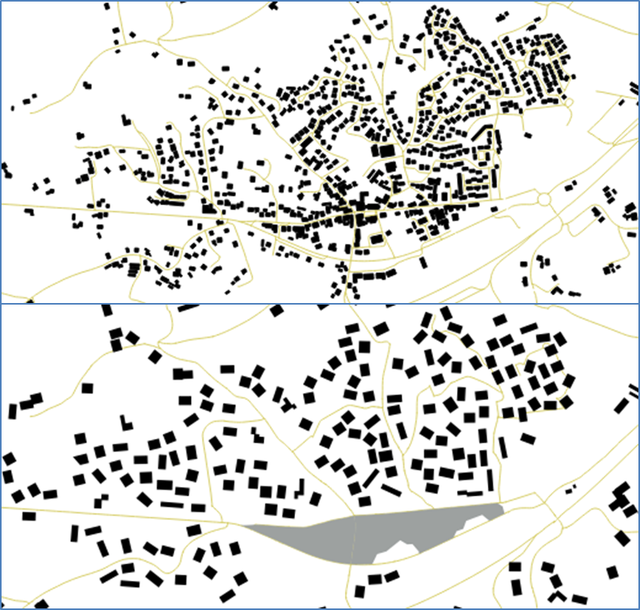
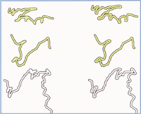
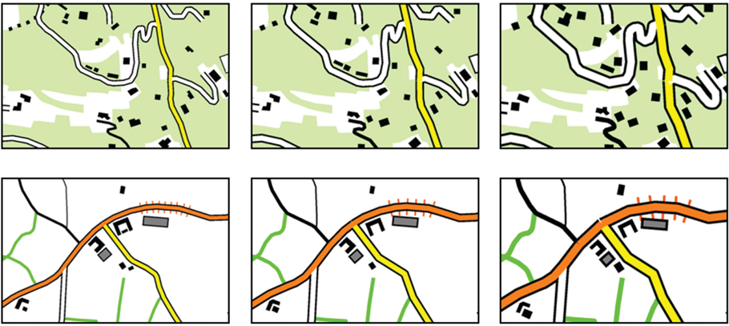

# CartAGen
CartAGen is a plugin for [GeOxygene][2] dedicated to cartographic generalisation maintained by [COGIT research team][1] from IGN France, the French national mapping agency. CartAGen is a research platform and is mainly focused on map generalization research needs.

> - Date 18/05/2017.
> - Author: [Guillaume Touya][1]
> - Contact {firstname.lastname}@ign.fr.

Description
-------------

CartAGen is a Java research platform dedicated to map generalization and [built upon many years of research at IGN France][6]. CartAGen can be seen as a plugin for [GeOxygene][2] Java platform or as a standalone platform.
It contains implementations of many generalization algorithms of the literature, but most of all, it contains implementations of [several map generalization processes][7] that automatically orchestrate these algorithms, including complete or partial implementations of the multi-agents based [AGENT][15], [CartACom][16], [GAEL][11], and [CollaGen][12] models.

AGENT generalization of a small town to 1:60k:

AGENT mountain road generalization [(Duchêne 2014)][14]:

CartACom generalization to 1:50k [(Duchêne et al. 2012)][16]:

Getting Started
-------------

- Install CartAGen by cloning it in your Java IDE (no executable version yet)

- Basic use of CartAGen:

> - [How to load a geographical dataset into CartAGen?][3]
> - [How to use the CartAGen application][10]

- Getting started with generalization:

> - [How to trigger generalization algorithms in CartAGen?][4]
> - [How to use the agent-based generalization processes?][5]
> - [How to use the ScaleMaster2.0?][18]

- Advanced use of CartAGen:

> - [Understanding CartAGen data schema for generalization][8]
> - [Spatial analysis and enrichment in CartAGen][17]

Watch videos
-------------
> These videos show past results of the IGN generalization models that are not reproducible with CartAGen yet.

[Gaffuri, J. (2007, September). Field deformation in an agent-based generalisation model: the GAEL model. In F. Probst and C. Kessler (Eds.), GI-days 2007 - young researches forum, Volume 30 of IFGI prints, pp. 1-24][13]

Duchêne, C. (2001, April). Road generalisation using agents. In G. Higgs and D. B. Kidner (Eds.), Proceedings of the GIS Research UK 9th Annual Conference, Glamorgan, UK. Wales Debating Federation/University of Glamorgan.

Implemented generalization algorithms
-------------

[A list, not exhaustive yet, of the generalization algorithms available in CartAGen platform][9]

[1]: http://recherche.ign.fr/labos/cogit/english/accueilCOGIT.php
[2]: https://github.com/IGNF/geoxygene
[3]: docs/tuto_import_data.md
[4]: docs/tuto_generalization_algo.md
[5]: docs/tuto_agents.md
[6]: http://aci.ign.fr/2010_Zurich/genemr2010_submission_10.pdf
[7]: https://www.researchgate.net/publication/281967532_Automated_generalisation_results_using_the_agent-based_platform_CartAGen
[8]: docs/tuto_schema.md
[9]: docs/algorithms.md
[10]: docs/tuto_gui.md
[11]: http://gi-tage.de/archive/2007/downloads/acceptedPapers/gaffuri.pdf
[12]: http://dx.doi.org/10.1007/978-3-642-19143-5_30
[13]: http://gi-tage.de/archive/2007/downloads/acceptedPapers/gaffuri.pdf
[14]: http://recherche.ign.fr/labos/util_basilic/publicDownload.php?id=3044
[15]: http://icaci.org/files/documents/ICC_proceedings/ICC2001/icc2001/file/f13041.pdf
[16]: http://dx.doi.org/10.1080/13658816.2011.639302
[17]: docs/spatial_analysis.md
[18]: docs/tuto_scalemaster.md
