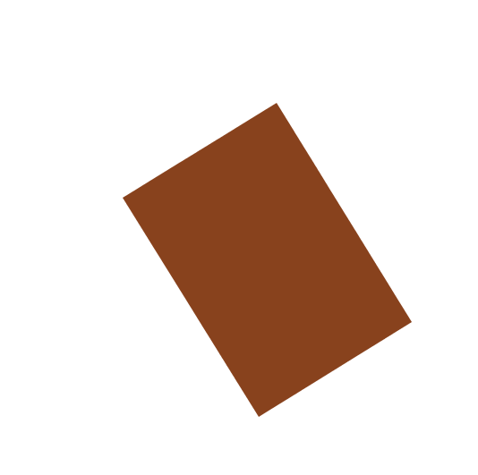

# Description of the Building Enlarge Algorithm and Enlarge to Rectangle Algorithm

> - Date 20/07/2017.
> - Author: [Guillaume Touya][1]
> - Contact {firstname.lastname}@ign.fr.

Description of the algorithms
-------------
Both algorithms enlarge buildings that are too small for being legible at a given scale. The enlarge algorithm simply transforms the initial geometry with a homothety to target area. The enlarge to rectangle algorithm replaces the polygon by its smallest surrounding rectangle and then adjusts the size of the rectangle with a homothety transformation.

Both algorithms have the same parameter described in the table below.

| Parameter name        | Description         				| Type 							| Default value			|
|:----------------------|:----------------------------------|:------------------------------|:--------------------------------------------------|
| goalArea    | the area the enlarged building should have after generalization	| double m²			| 								|

Examples of generalization
-------------
The images below show the same building (first image) enlarge for 1:50k with both methods.

When to use the algorithm?
-------------
With simple geometries, the enlarge to rectangle algorithm should be preferred as it also solves potential granularity issues and there is no need to trigger an additional simplification algorithm.
For more complex geomtries that would not be simplified as rectangles, the enlarge algorithm should be preferred.

[1]: https://umrlastig.github.io/guillaume-touya/
