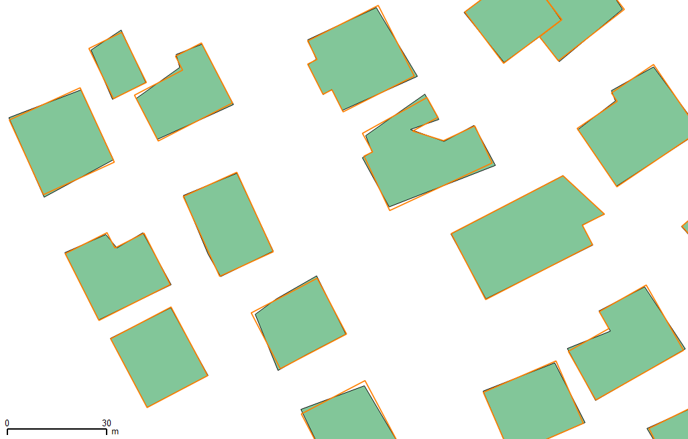
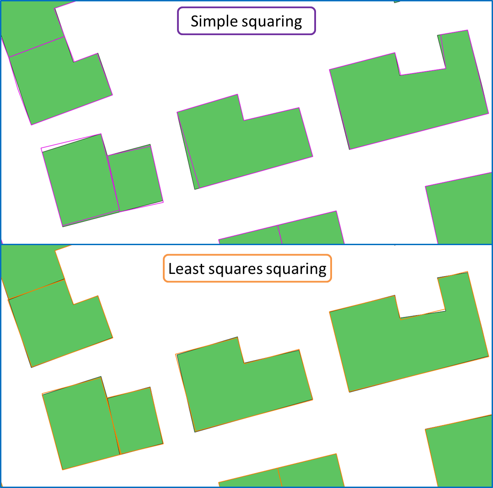

# Description of the Least Squares Based Building Squaring Algorithm

> - Date 20/07/2017.
> - Author: [Guillaume Touya][1]
> - Contact {firstname.lastname}@ign.fr.

Description of the algorithm
-------------
The squaring operation aims at the enhancement of man-made map features' orthogonal regularity: the angles that are almost 90° or almost 180° should be exactly set to 90° (and to 180° respectively) to reduce the noise in shape perception.
Squaring is a classical map generalization operation and several algorithms exist. This one is based on a least squares adjustment, that was used for map generalization by [Harrie][5] and [Sester][7], or for [conflation][8].
Linear equations are computed with the (x,y) coordinates of the building vertices as variables. The equations translate the geometrical constraints on segments and angles to force almost right angles to be exactly right, while preserving the general shape of the building.
The algorithm is fully descirbed in [(Lokhat & Touya 2016)][3].

Examples of generalization
-------------

When to use the algorithm?
-------------
The algorithm is dedicated to buildings and other orthogonal man-made map features (such as some sports fields).
[(Lokhat & Touya 2016)][3] shows that this algorithm is particularly effective on datasets with complex buildings where more simple algorithms fail.
Usually, in an agent-based system, it can be coupled with a [simple squaring algorithm][3] that is very quick for buildings with few vertices.

See Also
-------------
- [Building simplification algorithm][2]

- [Return to home page][6]

[1]: https://umrlastig.github.io/guillaume-touya/
[2]: /simplification.md
[3]: http://dx.doi.org/10.5311/JOSIS.2016.13.276
[4]: https://github.com/IGNF/CartAGen/blob/master/cartagen-core/src/main/java/fr/ign/cogit/cartagen/algorithms/polygon/PolygonSquaring.java
[5]: http://dx.doi.org/10.1023/a:1019765902987
[6]: https://ignf.github.io/CartAGen
[7]: http://dx.doi.org/10.1080/13658810500161179
[8]: http://dx.doi.org/10.3390/ijgi2030621
