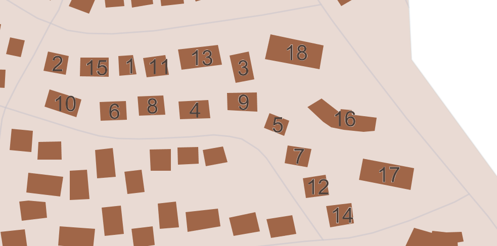

# Description of the Building Deletion Algorithm for Buildings in a Block Based on PROMETHEE

> - Date 20/07/2017.
> - Author: [Guillaume Touya][1]
> - Contact {firstname.lastname}@ign.fr.

Description of the algorithm
-------------
This algorithm is a multiple criteria based deletion of the exceeding buildings in a block. The criteria are similar to the [ELECTRE deletion algorithm][2] but rather than the [ELECTRE III][5] technique, the [PROMETHEE][6] multiple criteria decision technique is used. The criteria used are:
- congestion (the congestion measure from A. Ruas' PhD)
- congestion direction (or escape directions)
- building size (small buildings are more prone to deletion)
- corner position (buildings laying in the corner of a block should not be deleted)
- neighbour buildings (if neighbour buildings are similar, deletion is favoured)

Examples of generalization
-------------

The buildings in the block below are ordered according to the priority to be deleted: building tagged "1" is the first to be removed in that block. If more than one building needs to be removed, the algorithm should be triggered once again to update congestions measures (the output order might be different then).

When to use the algorithm?
-------------

See Also
-------------
- [ELECTRE deletion][2]
- [congestion deletion][3]
- [overlapping deletion][4]

[1]: https://umrlastig.github.io/guillaume-touya/
[2]: /algorithms/buildings/electre_deletion.md
[3]: /algorithms/buildings/congestion_deletion.md
[4]: /algorithms/buildings/overlaping_deletion.md
[5]: https://en.wikipedia.org/wiki/ELECTRE
[6]: https://pubsonline.informs.org/doi/pdf/10.1287/mnsc.31.6.647
