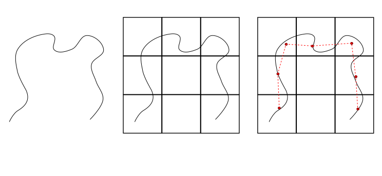
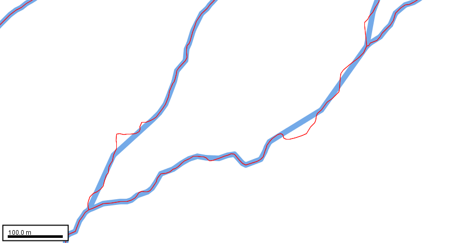

# Description of Li-Openshaw Line Simplification Algorithm

> - Date 20/07/2017.
> - Author: [Guillaume Touya][1]
> - Contact {firstname.lastname}@ign.fr.

Description of the algorithm
-------------
The [Li-Openshaw algorithm][5] simplifies lines based on the so-called natural principle: at a given scale, a feature with a size smaller than a certain perception limitation can be completely removed, as it cannot be properly seen.
The algorithm exists with different versions, but the one implemented here is the raster mode: a raster grid is put on top of the line (or polygon) to be simplified with the size of the cell being the minimum size that can be seen at the output scale.
Then, all the consecutive vertices of the line that are included in a same cell are replaced by a single vertex, which is the centroid of the vertices that are replaced.

| Parameter name        | Description         				| Type 							| Default value			|
|:----------------------|:----------------------------------|:------------------------------|:--------------------------------------------------|
| cell size    | the size of the cell used to simplify the line (only one vertex is retained per cell) | double (meters) 			| 								|

Examples of generalization
-------------
The image below shows the simplification of rivers with cell of 20 m.

When to use the algorithm?
-------------
The algorithm was designed to generalize natural lines, e.g. rivers, coastlines, countour lines.

See Also
-------------
- [Visvalingam-Whyatt algorithm][2]
- [Hexagon based Raposo algorithm][3]
- [Douglas-Peucker algorithm][4]

- [Return to home page][6]

[1]: https://umrlastig.github.io/guillaume-touya/
[2]: /visvalingam.md
[3]: /raposo.md
[4]: /douglas_peucker.md
[5]: https://www.tandfonline.com/doi/abs/10.1080/02693799208901921
[6]: https://ignf.github.io/CartAGen
