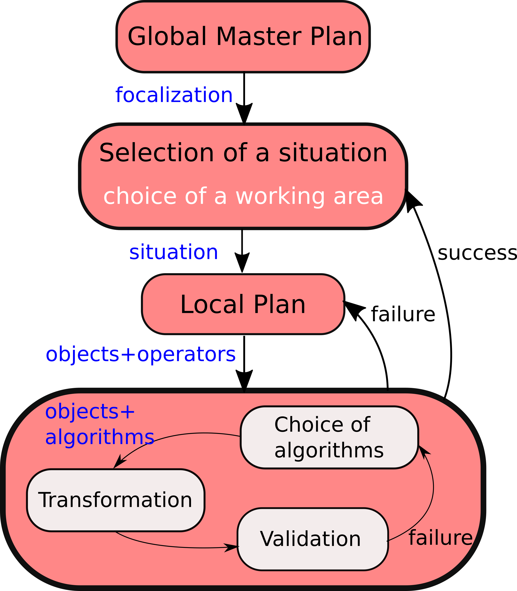
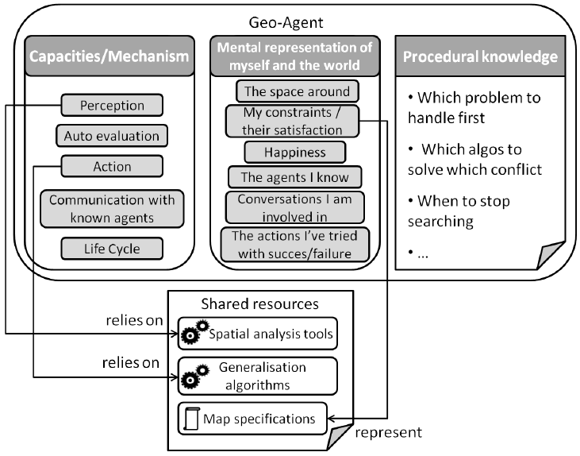
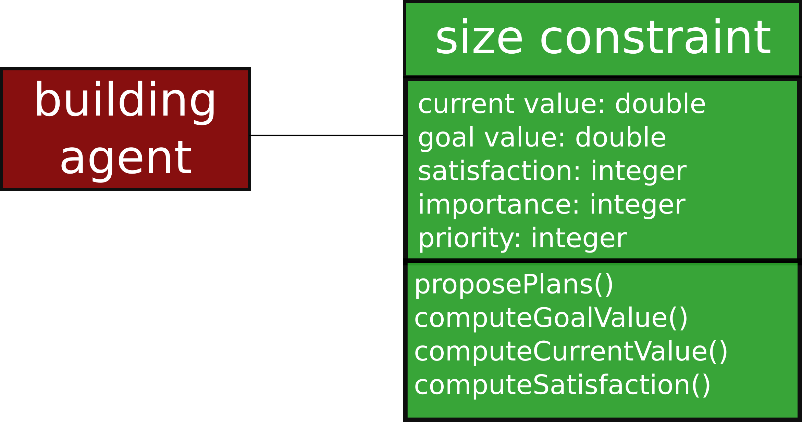
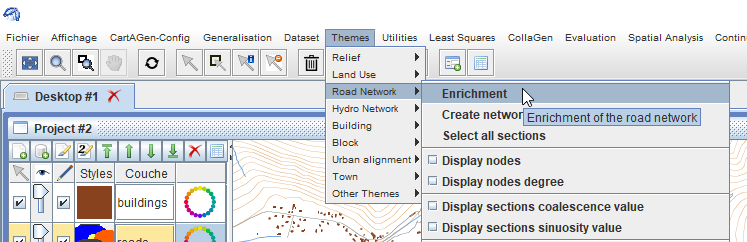
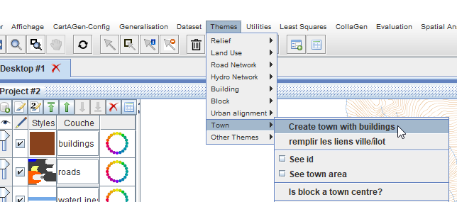
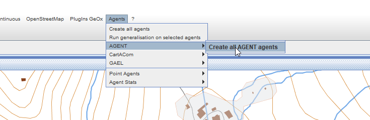
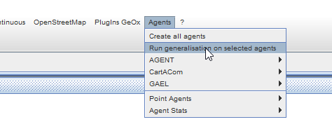
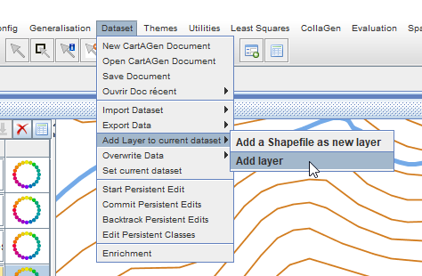
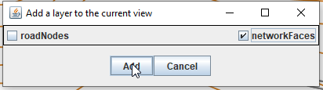

# Tutorial on agent-based generalization with CartAGen
This tutorial explains how to use the agent-based generalization model implemented in CartAGen: [AGENT][2], [CartACom][3], [GAEL][4], and [DIOGEN][5]. Be aware that each of these implementations are for now mainly based on research code that has not been consolidated. Many bugs still remain and some functionalities described in the papers describing the models are not implemented in CartAGen. Feel free to add issues in the Github platform, or to implement yourself the missing functionalities.

> - Date 20/07/2017.
> - Author: [Guillaume Touya][1]
> - Contact {firstname.lastname}@ign.fr.


The Basic Concepts of Agent-Based Generalization
-------------

#### [](#header-4)Step by step, knowledge-based local approach

Agent-based generalization follows a step by step, knowledge based approach, which arises from the seminal model from Ruas & Plazanet (96), illustrated in the schema below. The aim is not find a global solution to generalize the whole map at once, but to identify local situations that require generalization, and try generalization algorithms to improve the legibility of this situation.



#### [](#header-4)Geo-Agents

To achieve this step by step knowledge-based local approach, agent-based generalization uses the multi-agent paradigm, which is a [field of computer science research][17]. Agents are computer objects that have a goal and act autonomously in order to reach this goal thanks to capacities of perception, deliberation,
action, and possibly communication with other agents (Weiss, 1999). A geo-agent is an object from a topographic database (a road, a building, a contour line) that is given the capacities of an agent, and its goal is to be correctly generalized for a given map scale. The image below synthesizes how geo-agents are modelled in agent-based generalization.



The seminal work of Anne Ruas introduced several level of agents for the topographic maps with *meso* agents that are composed of *micro* agents or of other *meso* agents. For instance, a town agent (meso) is composed of block agents (meso) and road agents (micro), and a block agent is composed of building agents (micro).

#### [](#header-4)Constraints to monitor the agents

Since the proposition of Kate Beard in 1991, map generalization rules and specifications are mostly modelled with constraints. It is the case in the agent-based generalization as constraints monitor the whole process. Agents are *happy* if their constraints are completely satisfied, but they act and generalize themselves if these constraints are not satisfied. The image below shows how constraints are modelled in CartAGen, with a current value (the area of the building at the current point of the generalization process in this case), a goal value (the area the building should have to be legible at target scale), a satisfaction derived from the difference between current and goal values, an importance that assesses the relative importance of this constraint compared to the others, and a priority that assesses if this constraint should be addressed first, or can be addressed later in the step by step generalization (in this case, the size constraint has a high priority).




> To go further with the principles of agent-based generalization, reading [this chapter][15] by Ruas & Duchêne, or [this paper][16] by Duchêne et al. is highly recommended.

Generalizing data with AGENT
-------------
This tutorial explains how to quickly generalize the urban areas of the sample dataset. The first task is to load the sample dataset into CartAGen.

#### [](#header-4)Set the target scale

Then, we need to set the target scale of generalization. In this tutorial, we will set it to 1:50000 to have a significant simplification of the map.
To change the target scale, you need to open the generalization configuration frame by selecting it in the "Generalisation" menu (see image below).
In the frame, just change the scale and click on the validate button. The symbol sizes of roads, rivers, etc. should adjust to this target scale change, and you should see a clear need for generalization at this scale (symbols overlap).

  

#### [](#header-4)Set the AGENT parameters
The AGENT parameters allow the choice of the constraints that the agents will have to satisfy during generalization, and their relative importance.
To set the parameters, you need to open the dedicated frame by clicking on "AGENT configuration" in the "Generalisation" menu (see image below).


The AGENT configuration frame contains several tabs that enable choosing the constraints for different themes of the map (see the "building" tab in the image below).
To keep it simple, we won't select all the constraints, only the following ones for buildings (size, granularity and squareness), blocks (micro satisfaction, density and proximity) and towns (block satisfaction, and street density).


#### [](#header-4)Enrich the dataset
As usual in map generalization, the first step here is to enrich the dataset by creating the topology of the road networks, and by creating towns and blocks from the buildings and the road network.
To enrich the road network and build its topology (i.e. create road network nodes and the link between each road and its start and end node), in the "Themes" menu, click on "Enrichment" in the "Road network" submenu (see image below).



To create towns (from buildings, by dilation) and the blocks that cut towns with the faces of the road network, in the "Themes" menu, click on "Create town with buildings" in the "Town" submenu (see image below).



The towns and blocks should appear as new layers of the map.

#### [](#header-4)Create the agents

For now, we only have geographic features in the CartAGen system, we need to create agents for each building, road, etc.
To create these agents, simply click on the "Create all agents" item in the "Agents/AGENT" menu (see image below).



Nothing should change in the GUI, but the agents do exist.
To verify that they exist, you can select any building with one of the selection buttons of the toolbar, and click on the "Load selection" button in the right panel.
This should add the agent to the list of the scheduler.

#### [](#header-4)Generalize a building
Select any building of the dataset. You have two possibilities to generalize it with the CartAGen GUI:
- click on the "Load selection" button in the right panel, and then click on the "run" button to start generalization.
- click on "Run generalization on selected agents" in the "Agents" menu (see image below).



#### [](#header-4)Generalize a block
This works similarly to the generalization of a building but select a block feature rather than a building feature.

#### [](#header-4)Generalize a town
This works similarly to the generalization of a building but select a town feature rather than a building feature.
The generalization might be quite longer in this case as a town might contain many agents.


> To go further in the use of AGENT, see [this advanced tutorial][10].

Generalizing data with CartACom
-------------
The steps to run a CartACom generalization are pretty similar to the steps for AGENT generalization. When data has been imported, please follow the steps:

#### [](#header-4)Set the target scale

We need to set the target scale of generalization. In this tutorial, we will set it to 1:50000 to have a significant simplification of the map.
To change the target scale, you need to open the generalization configuration frame by selecting it in the "Generalisation" menu (see image below).
In the frame, just change the scale and click on the validate button. The symbol sizes of roads, rivers, etc. should adjust to this target scale change, and you should see a clear need for generalization at this scale (symbols overlap).

  


#### [](#header-4)Set the CartACom parameters

For now, there is no graphical user interface to set the CartACom parameters, but there are two xml files:
* src/main/resources/xml/cartacom/CartAComSpecifications.xml, which contains the parameters of the constraints to use in CartACom.
* src/main/resources/xml/cartacom/AllCartAComRelationalConstraintsDescriptors.xml, which contains the mapping between the relational constraints and the Java code of the constraints.

In the first file, CartAComSpecifications.xml, you can find the default code below. It describes the relational constraints to be used, with their name, and their importance (value between 0 and 10). The "to-consider" tag is used to define if the constraint is used in the CartACom process.

```xml
<?xml version="1.0" encoding="UTF-8"?>
<!-- The relational constraints to consider (among those defined as constraints descriptors) -->
<cartacom-relational-constraints-to-consider>
  <relational-constraint name = "BuildingNetFaceTopology">
    <importance>10.0</importance>
    <to-consider>true</to-consider>
  </relational-constraint>
  <relational-constraint name = "RoadBuildingProximity">
    <importance>9.0</importance>
    <to-consider>true</to-consider>
  </relational-constraint>
  <relational-constraint name = "SmallCompactsProximity">
    <importance>8.0</importance>
    <to-consider>true</to-consider>
  </relational-constraint>
  <relational-constraint name = "RoadBuildingParallelism">
    <importance>8.0</importance>
    <to-consider>true</to-consider>
  </relational-constraint>
</cartacom-relational-constraints-to-consider>
```

In the second file, you can find the mapping between the relational constraints, and the Java classes and methods that contain the code to compute the constraints current, goal values, etc. In the default file displayed below, for each constraint (described by its name, the same as the one in the previous file), there is first a reference to the Java class that describes the 'Relation' that is constrained. For instance, in the "RoadBuildingProximity" relational constraint, the Relation class is "fr.ign.cogit.cartagen.agentGeneralisation.cartacom.relation.buildingRoad.Proximity". Then, the classes that describe the types of agents involved in the constraint are listed in the following XML tags <agent-type-1> and <agent-type-2>.

> While the first file can easily be tuned to improve default results, this second file monitors an advanced use of CartACom, and most users should keep the default values.

```xml
<?xml version="1.0" encoding="UTF-8"?>
<cartacom-relational-constraints>
  <relational-constraint name = "BuildingNetFaceTopology">
    <relation-java-class>fr.ign.cogit.cartagen.agentGeneralisation.cartacom.relation.buildingnetface.Topology</relation-java-class>
    <agent-type-1>fr.ign.cogit.cartagen.agentGeneralisation.cartacom.agent.SmallCompactAgent</agent-type-1>
    <agent-type-2>fr.ign.cogit.cartagen.agentGeneralisation.cartacom.agent.NetworkFaceAgent</agent-type-2>
  </relational-constraint>
  <relational-constraint name = "RoadBuildingProximity">
    <relation-java-class>fr.ign.cogit.cartagen.agentGeneralisation.cartacom.relation.buildingRoad.Proximity</relation-java-class>
    <agent-type-1>fr.ign.cogit.cartagen.agentGeneralisation.cartacom.agent.SmallCompactAgent</agent-type-1>
    <agent-type-2>fr.ign.cogit.cartagen.agentGeneralisation.cartacom.agent.NetworkSectionAgent</agent-type-2>
  </relational-constraint>
  <relational-constraint name = "SmallCompactsProximity">
    <relation-java-class>fr.ign.cogit.cartagen.agentGeneralisation.cartacom.relation.buildingBuilding.Proximity</relation-java-class>
    <agent-type-1>fr.ign.cogit.cartagen.agentGeneralisation.cartacom.agent.SmallCompactAgent</agent-type-1>
    <agent-type-2>fr.ign.cogit.cartagen.agentGeneralisation.cartacom.agent.SmallCompactAgent</agent-type-2>
  </relational-constraint>  
  <relational-constraint name = "RoadBuildingParallelism">
    <relation-java-class>fr.ign.cogit.cartagen.agentGeneralisation.cartacom.relation.buildingRoad.Parallelism</relation-java-class>
    <agent-type-1>fr.ign.cogit.cartagen.agentGeneralisation.cartacom.agent.SmallCompactAgent</agent-type-1>
    <agent-type-2>fr.ign.cogit.cartagen.agentGeneralisation.cartacom.agent.NetworkSectionAgent</agent-type-2>
  </relational-constraint>  
</cartacom-relational-constraints>
```

#### [](#header-4)Enrich the dataset
As usual in map generalization, the first step here is to enrich the dataset by creating the topology of the road networks, and by creating network faces that are used delimit the radius of proximity constraints.
To enrich the road network and build its topology (i.e. create road network nodes and the link between each road and its start and end node), in the "Themes" menu, click on "Enrichment" in the "Road network" submenu (see image below).


Then, the next step is to create network faces features that are used to preserve the topological inclusion of buildings in one network face. In the "Themes" menu, click on "Create network faces" in the "Road network" submenu (just below "Enrichment" in the image above). Nothing should change in the display view but the network faces (and the topology of the roads) are created, and can be added as explicit objects in the map.



To add the network faces in the map, in the "Dataset" menu, click on "Add layer" in the "Add Layer to current dataset" submenu (see image above). Then, a dialog pops in which you can select one of the hidden layers (the road nodes and the network faces in this case, see image below). You just have to select the hidden layers you want to add and click on "Add" to make them visible in the map.



#### [](#header-4)Create the agents

For now, we only have geographic features in the CartAGen system, we need to create agents for each building, road, etc.
To create these agents, simply click on the "Create all agents" item in the "Agents/CartACom" menu (see image below).


Nothing should change in the GUI, but the agents do exist.
To verify that they exist, you can select any building with one of the selection buttons of the toolbar, and click on the "Load selection" button in the right panel.
This should add the agent to the list of the scheduler.

#### [](#header-4)Generalize a selection of buildings
Select any subset of the buildings of the dataset. You have two possibilities to generalize it with the CartAGen GUI:
- click on the "Load selection" button in the right panel, and then click on the "run" button to start generalization.
- click on "Run generalization on selected agents" in the "Agents" menu (see image below).


> To go further in the use of CartACom, see [this advanced tutorial][11].

Generalizing data with GAEL
-------------
The implementation of the GAEL model is for now only partially functional in CartAGen.
To be done...

> To go further in the use of GAEL, see [this advanced tutorial][12].

Generalizing data with DIOGEN
-------------
To be done...


> To go further in the use of DIOGEN, see [this advanced tutorial][13].

See Also
-------------
- [tutorial on data loading][8]
- [tutorial to generalize loaded data][9]
- [tutorial on CartAGen data schema][7]
- [advanced tutorial on AGENT][10]
- [advanced tutorial on CartACom][11]
- [advanced tutorial on GAEL][12]
- [advanced tutorial on DIOGEN][13]
- [advanced tutorial on CollaGen][14]

- [Return to main page][6]


[1]: http://www.tandfonline.com/doi/abs/10.1080/13658810410001672881
[2]: http://icaci.org/files/documents/ICC_proceedings/ICC2001/icc2001/file/f13041.pdf
[3]: http://dx.doi.org/10.1080/13658816.2011.639302
[4]: https://www.researchgate.net/publication/221225232_Systeme_multi-agent_pour_la_deformation_en_generalisation_cartographique
[5]: http://www.tandfonline.com/doi/full/10.1080/23729333.2017.1300997
[6]: https://ignf.github.io/CartAGen
[7]: /tuto_agents.md
[8]: /tuto_import_data.md
[9]: /tuto_schema.md
[10]: /agents/AGENT_advanced.md
[11]: /agents/CartACom_advanced.md
[12]: /agents/GAEL_advanced.md
[13]: /agents/DIOGEN_advanced.md
[14]: /agents/CollaGen_advanced.md
[15]: http://dx.doi.org/10.1016/b978-008045374-3/50016-8
[16]: https://hal.inria.fr/IFSTTAR/hal-01682131v1
[17]: https://en.wikipedia.org/wiki/Multi-agent_system
