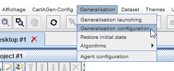
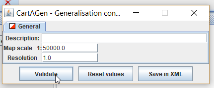
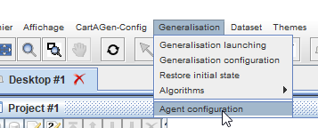
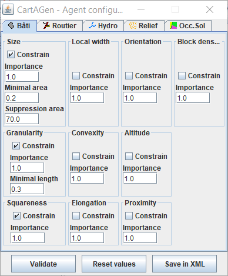

# Tutorial on agent-based generalization with CartAGen
This tutorial explains how to use the agent-based generalization model implemented in CartAGen: [AGENT][2], [CartACom][3], [GAEL][4], and [DIOGEN][5]. Be aware that each of these implementations are for now mainly based on research code that has not been consolidated. Many bugs still remain and some functionalities described in the papers describing the models are not implemented in CartAGen.

> - Date 20/07/2017.
> - Author: [Guillaume Touya][1]
> - Contact {firstname.lastname}@ign.fr.

The Basic Concepts of Agent-Based Generalization
-------------
To be done...

Generalizing data with AGENT
-------------
This tutorial explains how to quickly generalize the urban areas of the sample dataset.

#### Set the target scale

  

#### Set the AGENT parameters

#### Enrich the dataset

#### Create the agents

#### Generalize a building

#### Generalize a block

#### Generalize a town

> To go further in the use of AGENT, see [this advanced tutorial][10].

Generalizing data with CartACom
-------------
To be done...

Generalizing data with GAEL
-------------
The implementation of the GAEL model is for now only partially functional in CartAGen.
To be done...

Generalizing data with DIOGEN
-------------
To be done...

See Also
-------------
- [tutorial on data loading][8]
- [tutorial to generalize loaded data][9]
- [tutorial on CartAGen data schema][7]
- [advanced tutorial on AGENT][10]
- [advanced tutorial on CartACom][11]
- [advanced tutorial on GAEL][12]

- [Return to main page][6]

[1]: http://www.tandfonline.com/doi/abs/10.1080/13658810410001672881
[2]: http://icaci.org/files/documents/ICC_proceedings/ICC2001/icc2001/file/f13041.pdf
[3]: http://dx.doi.org/10.1080/13658816.2011.639302
[4]: https://www.researchgate.net/publication/221225232_Systeme_multi-agent_pour_la_deformation_en_generalisation_cartographique
[5]: http://www.tandfonline.com/doi/full/10.1080/23729333.2017.1300997
[6]: https://ignf.github.io/CartAGen
[7]: /tuto_agents.md
[8]: /tuto_import_data.md
[9]: /tuto_schema.md
[10]: /AGENT_advanced_tutorial.md
[11]: /CartACom_advanced_tutorial.md
[12]: /GAEL_advanced_tutorial.md
