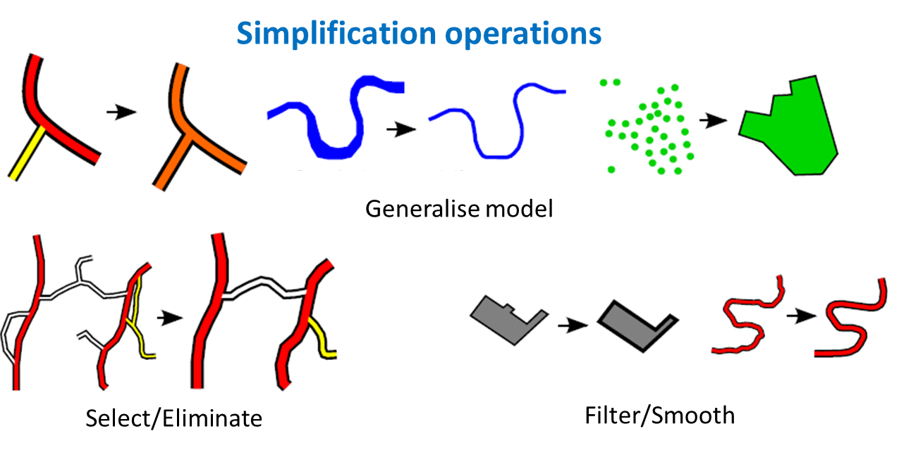
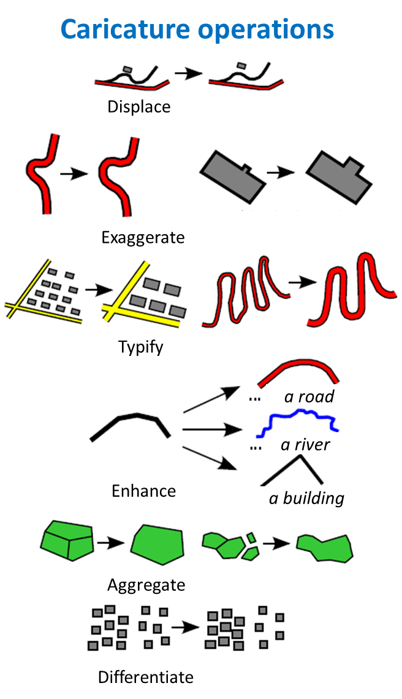
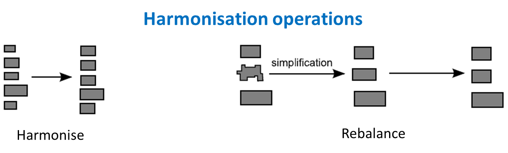
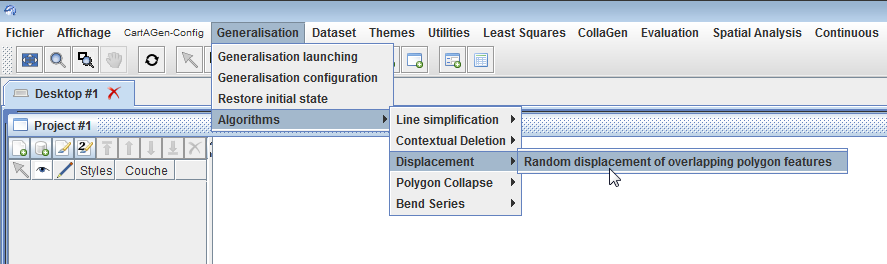
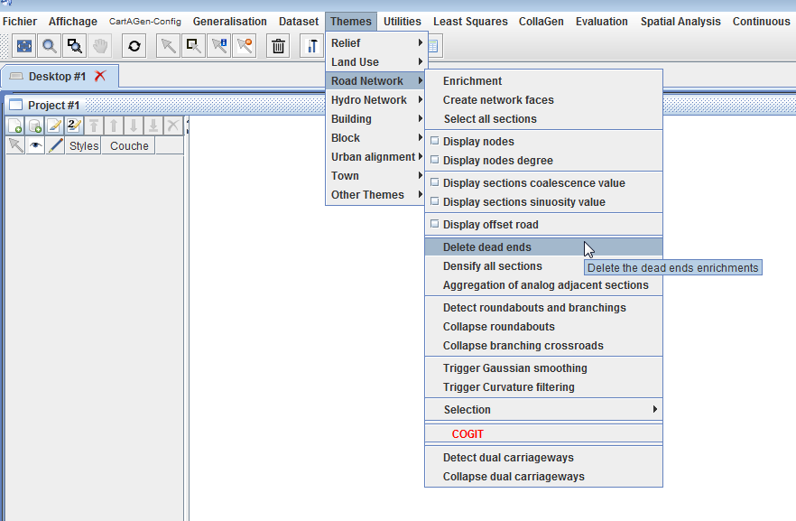

# Tutorial on how to generalize data loaded in CartAGen
The building blocks of map generalization are the algorithms that are triggered on one map object or on group of map objects. Before orchestrating their application on a complete map, it is necessary to learn of to test them on a sample dataset, and that's the aim of this tutorial.
The tutorial:
- first explains how to trigger the available from the GUI menu buttons; 
- then, the tutorial describes how these algorithms can be located in the CartAGen library;
- then, for developers (CartAGen is mainly dedicated to developers for now), the following section of the tutorial shows an example where an algorithm is encapsulated in a piece of code to enlarge and displace of the buildings of a dataset;
- finally the tutorial explains how to add one of the any algorithms of the research literature taht are not implemented in CartAGen yet.

> - Date 20/07/2017.
> - Author: [Guillaume Touya][1]
> - Contact {firstname.lastname}@ign.fr.


Where are the algorithms in the Java library?
-------------

Generalization operations are atomic transformations of map objects that improve the legibility of the objects at target scale. 
There are many different taxonomies of generalization operations (or operators), but the one illustrated in the images below derives from Sébastien Mustière's PhD thesis.

    

A generalization algorithm is an algorithm that instanciates one or several generalization operations. For instance, the famous Douglas & Peucker algorithm is an algorithm that instanciates the filtering operation.

See more information on generalization operations and algorithms in [this chapter][11] from the ICA commission 2014 book.

Most algorithms available in CartAGen are located in the [algorithms package][9] of the cartagen-core project. However, some simple geometrical algorithms such as Gaussian smoothing or Douglas & Peucker filtering are included in the geometry computation methods of [GeOxygene library][10], on which CartAGen is built upon.

> TIP: To know where the code of an algorithm is, look at the code of the menu button that triggers the algorithm (in the package `fr.ign.cogit.cartagen.appli.core.themes` of cartagen-appli module).

> There is a list of the available algorithms with descriptions [at this page][2]


Triggering algorithms with the menu buttons
-------------
#### [](#header-4)Generic algorithms

Some of the [available algorithms][2] are generic, which means they can be used on different types of geographic features, and even sometimes different types of geometry. 
For instance, the simplification algorithms provided in CartAGen can be used on any type of line or polygon feature (even if they are not always effective on every type of feature, see the detailed description of the algorithms).
Some of these algorithms can be manually triggered on the selected geographic features in the GUI: click on the menu items in the Generalisation->Algorithms menu (see image below).



#### [](#header-4)Theme specific algorithms

Some other algorithms are clearly dedicated to specific types of features, and cannot be triggered on different features. 
The 'Themes' menu (see image below) contains sub-menus and menu items to use theme-specific algorithms. 
For instance, the 'Road Network' sub-menu contains menu items to 'Detect Roundabouts' and 'Collapse Roundabouts'



CartAGen is not supposed to be an interactive platform to carry out generalization on loaded data for production issues. 
It is intended as a research platform, at least its GUI, and these menus are mostly helpful to design new algorithms and to design new generalization processes that orchestrate different algorithms. 
For instance, it is useful to test the algorithms on its own data before choosing which ones can be included in an [agent-based generalization process][4].


Example: enlarging and displacing buildings in the sample dataset
-------------
##### [](#header-5) What we want to do
What we want to do in this example is to generalize the buildings of the [sample dataset][3] to the 1:30,000 scale, by enlarging them, simplifying them and removing symbol overlaps (between two buildings and between buildings and road symbols) by a [contextual displacement][5].
The contextual displacement works on a group of buildings to displace them optimally in the free space around them, so first, groups of buildings have to be computed, and each of these groups will be generalize as a whole.

All these steps can be achieved by an interactive use of the GUI menus, but this part of the tutorial shows how to do this by code.

##### [](#header-5) Set the scale and update symbol sizes
```java
	// first, set the symbolisation scale to 1:30k (this is the target scale of the tutorial generalisation process)
	// To do that, we first need to get the current SLD
	StyledLayerDescriptor sld = CartAGenDoc.getInstance().getCurrentDataset().getSld();
	// then update the symbolisation to the new target scale
	SLDUtilCartagen.changeSymbolisationScale(30000.0, sld);
```

##### [](#header-5) Compute the building groups

```java
      // get the network sections that delimit groups (i.e. roads and rivers)
      IFeatureCollection<IFeature> sections = new FT_FeatureCollection<>();
      sections.addAll(dataset.getRoads());
      sections.addAll(dataset.getWaterLines());

      // create the groups with a 25.0 m threshold for building buffering
      Collection<IUrbanBlock> groups = UrbanEnrichment
          .createBuildingGroups(sections, 25.0, 10.0, 12, 2.0, 5000.0);
```

##### [](#header-5) Loop on the building groups

```java
	for(IUrbanBlock group: groups){
		// generalise the group...
	}
```

##### [](#header-5) Enlarge and simplify all the buildings of the group

```java
          // in this case, we only added buildings as urban elements, so no need
          // to check (there can be parks, squares, sports fields...)
          // the class GeneralisationSpecifications is used: it contains
          // standard values for classical generalisation specifications, such
          // as the minimum size of a building in map mm²

          // first enlarge the building geometry
          // compute the goal area
          double area = building.getGeom().area();
          double goalArea = area;
          double aireMini = GeneralisationSpecifications.AIRE_MINIMALE_BATIMENT
              * Legend.getSYMBOLISATI0N_SCALE()
              * Legend.getSYMBOLISATI0N_SCALE() / 1000000.0;
          if (area <= aireMini) {
            goalArea = aireMini;
          }
          // compute the homothety of the building geometry
          IPolygon geom = CommonAlgorithms.homothetie(
              (IPolygon) building.getGeom(), Math.sqrt(goalArea / area));

          // then simplify the building
          IGeometry simplified = SimplificationAlgorithm.simplification(geom,
              GeneralisationSpecifications.LONGUEUR_MINI_GRANULARITE
                  * Legend.getSYMBOLISATI0N_SCALE() / 1000.0);
          
          // apply the new geometry to the building
          building.setGeom(simplified);
```

##### [](#header-5) Displace the buildings in the group

```java
        // trigger the displacement of the enlarged and simplified features
        BuildingDisplacementRandom.compute(group);
```

Be careful, the processing time on the whole sample dataset can be long (around 5 minutes).

Guidelines to add a new generalization algorithm into CartAGen
-------------
This explains shows the best practices to add a new algorithm in CartAGen. The guidelines are examplified with the addition of the amalgamation algorithm from [Damen et al. (2008)][6].

#### [](#header-4)Where to write the code of the algorithm?
The algorithms are all located in the same package :```fr.ign.cogit.cartagen.algorithms```. The package contains several subpackages that gather "similar" algorithms even though the categorization is quite rough.
In our example, the algorithm amalgamates a group of close buildings in a building block, so we choose to add it in the ```fr.ign.cogit.cartagen.algorithms.block``` package. This package contains a class (```fr.ign.cogit.cartagen.algorithms.block.BuildingAggregation```) for building aggregation (quite similar to amalgamation) algorithms in which we will be adding the new algorithm.

#### [](#header-4)Is there a template to write an algorithm in CartAGen?
No, there is no template to write the code of a new algorithm in CartAGen. The algorithm can be coded as a public method in a class that contains several algorithms, as a static class (that's the chosen way in this tutorial but not the best way), or as a class.
However, there are some guidelines to make the algorithm useful for all the users of CartAGen:
- use the centralized schema interfaces as input/output of the algorithm: e.g. if the algorithm processes buildings, use the ```IBuilding``` interface.
- if the algorithm is generic in terms of features, prefer the geometry interfaces (IPoint, ILineString, or IPolygon) as input/output of the algorithm. For instance, the Douglas & Peucker algorithm is not dedicated to a specific features, so the CartAGen implementations use ILineString (and IPolygon) as input and output of the algorithm, because it can process any feature with a line (or polygon) geometry.
- most algorithms make use of basic/advanced geometrical algorithms (e.g. dilation, erosion, closing, opening here) that might be already available in [GeOxygene][7], the library that manages features and geometries for CartAGen, so before implementing something new, please check if it does not already exist in GeOxygene.

```java
    public static Collection<IBuilding> computeMorphologicalAmalgamation(Collection<IBuilding> buildings, double bufferSize){
    // initialise
    Collection<IBuilding> outCollection = new HashSet<>();
    Collection<IPolygon> clusters = new HashSet<>();
    IMultiSurface<IPolygon> multiPolygon = GeometryEngine.getFactory()
        .createMultiPolygon();
    for (IBuilding building : buildings)
      multiPolygon.add(building.getGeom());

    MorphologyTransform morph = new MorphologyTransform(bufferSize, 20);
    morph.setCapForm(BufferParameters.CAP_FLAT);
    IMultiSurface<IPolygon> closedGeom = morph
        .closingMultiPolygon(multiPolygon);
    IGeometry merged = morph.opening(closedGeom);

    if (merged instanceof IPolygon) {
      clusters.add((IPolygon) merged);
    } else if (merged instanceof IMultiSurface) {
      for (IPolygon simple : ((IMultiSurface<IPolygon>) merged).getList())
        clusters.add(simple);
    }

    // from the collection of output polygon, create a new building feature
    // from each of these polygons
    for (IPolygon clusterPolygon : clusters) {

      IPolygon simplified = edgeRemovalSimplification(clusterPolygon,
          edgeLength);

      // simplify the polygon by removing small edges
      IBuilding newBuilding = CartAGenDoc.getInstance().getCurrentDataset()
          .getCartAGenDB().getGeneObjImpl().getCreationFactory()
          .createBuilding(simplified);
      outCollection.add(newBuilding);
    }
    return outCollection;
    }
```

#### [](#header-4)Documenting the added algorithm

Of course, comments should be added in the code, as much as possible, to document the algorithm (see the example below).

```java
  /**
   * Algorithms to amalgamate a collection of buildings into one (or several)
   * square amalgamated polygon, using morphological operators. The algorithm is
   * an implementation of the paper from Damen et al. (2008, ICA Workshop in
   * Montpellier). Here, the sequence of operators is closure, then opening,
   * then edge removal.
   * 
   * @param buildings
   * @param bufferSize the size of the buffer for the dilation/erosion
   *          operations.
   * @param edgeLength the minimum length for final edges of the polygon
   *          (smaller edges are removed).
   * @return
   */
```

The website that describes and documents the CartAGen project (i.e. this website), also contains descriptions of the available algorithms, so the addition of a new algorithm should involve the addition of a new webpage to document the algorithm. You can find [here][8] the page that documents the Damen et al. algorithm used above as an example.

See Also
-------------
- [List of available algorithms][2]
- [tutorial on data loading][3]
- [tutorial to generalize loaded data with agent-based processes][4]

- [Return to main page][12]

[1]: http://recherche.ign.fr/labos/cogit/english/cv.php?prenom=&nom=Touya
[2]: /algorithms.md
[3]: /tuto_import_data.md
[4]: /tuto_agents.md
[5]: /algorithms/buildings/random_displacement.md
[6]: https://kartographie.geo.tu-dresden.de/downloads/ica-gen/workshop2008/04_Damen_et_al.pdf
[7]: https://github.com/IGNF/geoxygene
[8]: /algorithms/buildings/morpho_amalgamation.md
[9]: https://github.com/IGNF/CartAGen/tree/master/cartagen-core/src/main/java/fr/ign/cogit/cartagen/algorithms
[10]: https://github.com/IGNF/geoxygene/tree/master/geoxygene-spatial/src/main/java/fr/ign/cogit/geoxygene
[11]: https://link.springer.com/chapter/10.1007%2F978-3-319-00203-3_6
[12]: https://ignf.github.io/CartAGen
