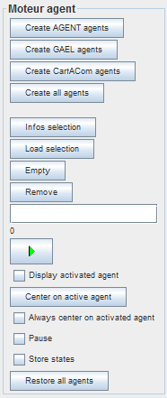
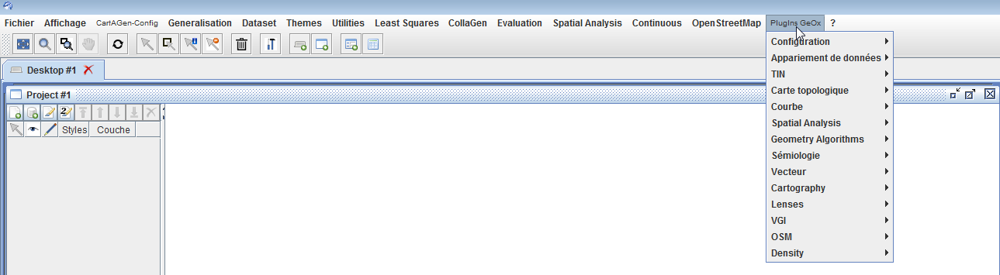
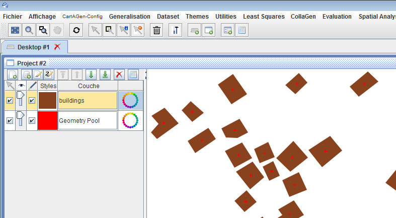
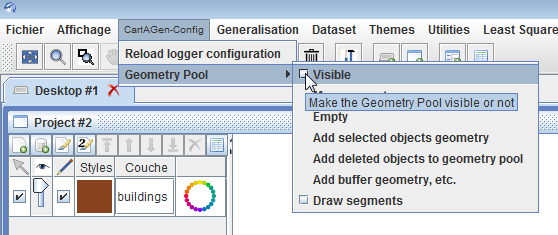

# Tutorial to use the CartAGen user interface
This tutorial explains how to use the CartAGen application user interface, and its main components.

> - Date 20/07/2017.
> - Author: [Guillaume Touya][1]
> - Contact {firstname.lastname}@ign.fr.


Starting CartAGen Application
-------------
CartAgen is not an executable program yet, you need to clone the Java project into an IDE, such as [Eclipse][2] first, before being used. Please refer to the tutorials of your IDE to know how to clone a Github project.
Once the project is cloned, there are Java main programs that can be used to run CartAGen:
- [CartAGenApplicationAgent][3] runs the standard CartAGen application and opens the CartAGen GUI.
- [CartAGenApplicationNoAgent][4] runs a CartAGen application without the interfaces related to agent management.

Both are located in the cartgen-appli project, which contains all the code related to cartagen GUI.

CartAGen plugins: how it works and how to add new ones
-------------
#### [](#header-4)Available plugins

| Plugin name        | Code 							| Short description				|
|:----------------------|:----------------------------------|:------------------------------|
| [Least squares][10]   | [LeastSquaresComponent.java][16]  	| triggers least squares based generalisation processes	|
| [Evaluation][11]	 | [EvaluationComponent.java][17] | contains methods to evaluate the results of generalisation |
| [CollaGen][12]   | [CollaGenComponent.java][18] | an incomplete implementation of the [CollaGen model][22]| 
| [Spatial Analysis][13]   | [SpatialAnalysisComponent.java][19] |   contains spatial analysis tools to characterise data prior to generalisation	|
| [Continuous][14]   | [ContinuousGUIComponent.java][20] | contains tools for continuous generalisation and morphing	| 
| [OpenStreetMap][15]   | [OSMCartAGenPlugin.java][21] | contains specific processes such as the LoD harmonisation for OpenStreetMap data	| 


#### [](#header-4)How to add new plugins

The example code below shows how to create a new plugin for CartAGen, you just have to extend the ```java JMenu ``` class in a new class (here called "NewPlugin") and add items and actions to this new menu.

```java
public class NewPlugin extends JMenu {

  public NewPlugin(String title) {
    super(title);
	...// add menu items and actions to this new menu
    }
	
	...
}
```

Then, if you want to add the new plugin in the CartAGen GUI, you have to modify the CartAGenGUIComponents.xml file that can be found in the cartagen-appli/src/main/resources/xml/ folder. 
The example code below shows how to add the "NewPlugin" plugin into the file. When CartAGen is launched once again, the NewPlugin should appear on the right of the existing menus.

```xml
<Config-CartAGen-GUI-Components>
	<Component>
		<name>Utilities</name>
		<path>fr.ign.cogit.geoxygene.appli.plugin.cartagen.util.UtilitiesGUIComponent</path>
	</Component>
		<Component>
		<name>Least Squares</name>
		<path>fr.ign.cogit.cartagen.appli.plugins.process.leastsquares.LeastSquaresComponent</path>
	</Component>
	<Component>
		<name>CollaGen</name>
		<path>fr.ign.cogit.cartagen.appli.plugins.process.CollaGenComponent</path>
	</Component>
	<Component>
		<name>Evaluation</name>
		<path>fr.ign.cogit.cartagen.appli.plugins.evaluation.EvaluationComponent</path>
	</Component>
	<Component>
		<name>Spatial Analysis</name>
		<path>fr.ign.cogit.cartagen.appli.plugins.spatialanalysis.SpatialAnalysisComponent</path>
	</Component>
	<Component>
		<name>Continuous</name>
		<path>fr.ign.cogit.geoxygene.appli.plugin.cartagen.util.ContinuousGUIComponent</path>
	</Component>
	<Component>
		<name>OpenStreetMap</name>
		<path>fr.ign.cogit.cartagen.appli.plugins.vgi.OSMCartAGenPlugin</path>
	</Component>
	<Component>
		<name>NewPlugin</name>
		<path>fr.ign.cogit.cartagen.appli.plugins.NewPlugin</path>
	</Component>
</Config-CartAGen-GUI-Components>
```

Description of the menus of the application
-------------

#### [](#header-4)File Menu

The File menu is the standard File menu of the GeOxygene application that CartAGen extends.
- New Desktop: add a new desktop, i.e. a new space to create one or several projects.
- New Project: create a new project, i.e. a new view panel that can contain a different dataset. For instance, two different maps of the same area can be loaded in different projects, and be synchronised.
- Open File: add a new layer from a shapefile.
- Load SLD: load a previously stored SLD format file, and apply the style on the current layers.
- New PostGIS Layer: add a new layer from a PostGIS table (a window opens to fill the database connection information).
- Save Layer as ...: save the selected layer as a shapefile. 
- Save As Image: save the content of the view panel as an image (that can be geolocated).
- Save As SLD: save the current style information in a SLD format file that can be reused later.
- Print: to print the content of the view panel.
- Exit: exit the application.

#### [](#header-4)View Menu

The menu first contains items to go to predefined display scales, or to a custom display scale.
The "Go To" item allows to go to a point given its coordinates.
There is also a toggle to display mouse coordinates.

#### [](#header-4)CartAGen-Config Menu

#### [](#header-4)Generalisation Menu

#### [](#header-4)Dataset Menu

#### [](#header-4)Themes Menu
The themes menu contains sub-menus for the main data themes that can be found in a topographic map. These sub-menus contain enrichment or generalisation algorithms specific for this theme. 
For instance, the building sub-menu contains the algorithms for building generalisation that are available in CartAGen.
The sub-menus are the following:
- Relief
- Land use
- Road network
- Hydro network
- Buildings
- Blocks
- Urban alignment
- Towns
- Other themes

#### [](#header-4)Utilities Menu

This menu contains several utility tools, such as typical tools found in GIS software.
- Bookmark tool: it enables the storage of views in a file, and when the application is re-run, it is possible to go back to the exact same view by selecting the bookmark previously stored.
- Selection tools: contains a tool to save a selection of objects, in order to load it back once the application has been re-run; also contains a query tool that follows the OGC Filter standard to select feature with specific attribute values.
- Draw WKT geometry: draws in the geometry pool a geometry described by a WKT string. Useful when debugging as intermediate geometries in algorithms can be logged in WKT.
- Display initial geometries: displays the initial geometries in the geometry pool, which is useful to compare before/after generalisation.
- Change the Locale settings: for now it is only possible to switch between French and English. This changes the language of the application components.

#### [](#header-4)Agent Menu

The Agent Menu gives predefined set of actions to trigger some agent-based generalisation.

- Create all agents: create agents for each geographic feature in the layers of the view panel (AGENT, CartACom and GAEL agents are created, which enables the use of either model).
- Run generalisation on selected agents: run the generalisation of the selected features by starting the agent life cycle of the associated agents of the feature.
- AGENT: create only the AGENT model agents from the loaded geographic layers.
- CartACom: create only the CartACom model agents from the loaded geographic layers.
- GAEL: create only the GAEL model agents from the loaded geographic layers.

The Agent menu goes along with a toolbar on the right side of the view panel that gives access to the same controls as the menu, but also gives controls on the life cycle of the agents during the generalisation (pause, step-by-step).




GeOxygene Plugins
-------------
The CartAGen application is just an extension of the GeOxygene application, with new interface components. 
So, the application can also access to GeOxygene plugins, that work similarly to CartAGen plugins: they usually add a menu with items to access to the geoprocessing algorithms of the GeOxygene platform (data matching, conflation, topological processing, styling, etc.).

The choice of the GeOxygene plugins that are loaded in the CartAGen application is made by filling the geoxygene-configuration.xml file in the cartagen-appli project. The plugins appear in the "Plugins GeOx" menu of the GUI (see image below).



You can find more information on GeOxygene capabilities on [this website][5]. Be aware that a large part of the GeOxygene documentation is in French.

The geometry pool
-------------
The rendering of geographic features works with layers of geographic features, following the OGC standards. But sometimes, it is useful to draw additional geometries, such as final or intermediate geometries of a generalisation algorithm. 
To allow this, CartAGen uses a specific layer, called the Geometry Pool, where any geometry can be rendered with a specific style, on top of the other layers (see image below).



The geometry pool can be made visible, or can be hidden, by using the "visible" check box, in the CartAGen-Config>Geometry Pool menu (see image below).



The CartAGen-Config>Geometry Pool menu also allows the manipulation of the geometry pool (adding the selected features' geometry, clearing the pool, etc.). 
The geometry pool can also be handled in the code. The example code below shows how to retrieve the geometry pool associated with a CartAGen database:

```java
GeometryPool pool = CartAGenDoc.getInstance().getCurrentDataset().getGeometryPool();
```

> TIP: some interface components may be labeled in French, even when using an English locale setting. Please report an issue on Github to have it corrected quickly!

See Also
-------------
- [tutorial on data loading][8]
- [tutorial to generalize loaded data][6]
- [tutorial on CartAGen data schema][9]
- [tutorial to use agent-based generalization][7]

- [Return to main page][23]

[1]: http://recherche.ign.fr/labos/cogit/english/accueilCOGIT.php
[2]: https://www.eclipse.org/
[3]: https://github.com/IGNF/CartAGen/blob/master/cartagen-appli/src/main/java/fr/ign/cogit/cartagen/appli/core/CartAGenApplicationAgent.java
[4]: https://github.com/IGNF/CartAGen/blob/master/cartagen-appli/src/main/java/fr/ign/cogit/cartagen/appli/core/CartAGenApplicationNoAgent.java
[5]: http://ignf.github.io/geoxygene/
[6]: /tuto_generalization_algo.md
[7]: /tuto_agents.md
[8]: /tuto_import_data.md
[9]: /tuto_schema.md
[10]: /plugins/least_squares_plugin.md
[11]: /plugins/evalaution_plugin.md
[12]: /plugins/collagen_plugin.md
[13]: /plugins/spatial_analysis_plugin.md
[14]: /plugins/continuous_plugin.md
[15]: /plugins/openstreetmap_plugin.md
[16]: https://github.com/IGNF/CartAGen/blob/master/cartagen-appli/src/main/java/fr/ign/cogit/cartagen/appli/plugins/process/leastsquares/LeastSquaresComponent.java
[17]: https://github.com/IGNF/CartAGen/blob/master/cartagen-appli/src/main/java/fr/ign/cogit/cartagen/appli/plugins/evaluation/EvaluationComponent.java
[18]: https://github.com/IGNF/CartAGen/blob/master/cartagen-appli/src/main/java/fr/ign/cogit/cartagen/appli/plugins/process/CollaGenComponent.java
[19]: https://github.com/IGNF/CartAGen/blob/master/cartagen-appli/src/main/java/fr/ign/cogit/cartagen/appli/plugins/spatialanalysis/SpatialAnalysisComponent.java
[20]: https://github.com/IGNF/geoxygene/blob/master/geoxygene-appli/src/main/java/fr/ign/cogit/geoxygene/appli/plugin/cartagen/util/ContinuousGUIComponent.java
[21]: https://github.com/IGNF/CartAGen/blob/master/cartagen-appli/src/main/java/fr/ign/cogit/cartagen/appli/plugins/vgi/OSMCartAGenPlugin.java
[22]: https://www.researchgate.net/publication/226629945_CollaGen_Collaboration_between_automatic_cartographic_Generalisation_Processes
[23]: https://ignf.github.io/CartAGen