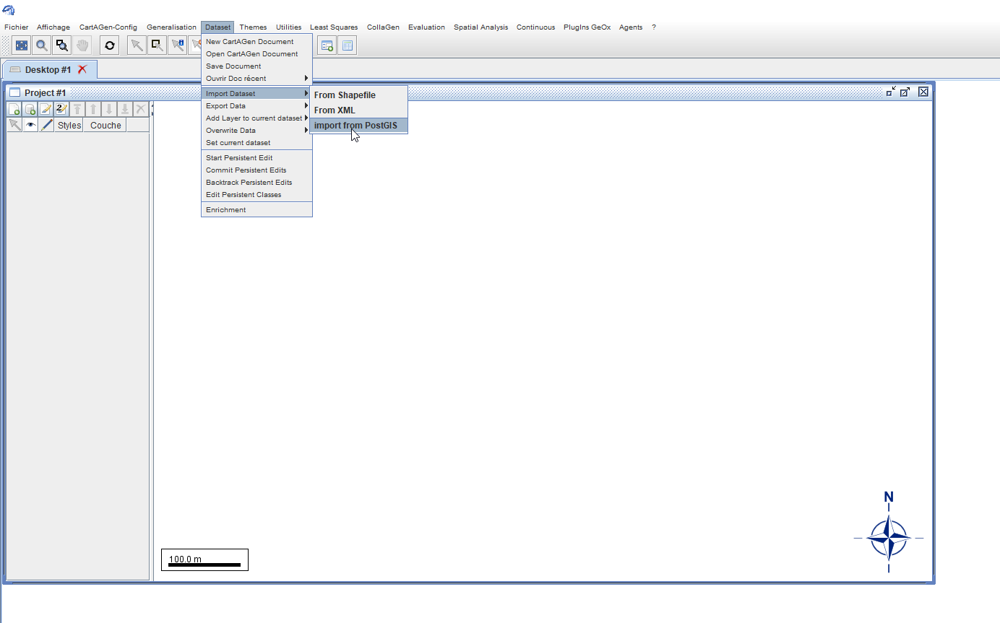
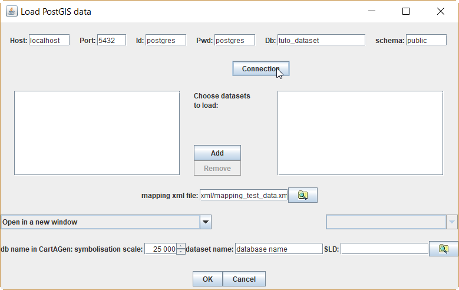
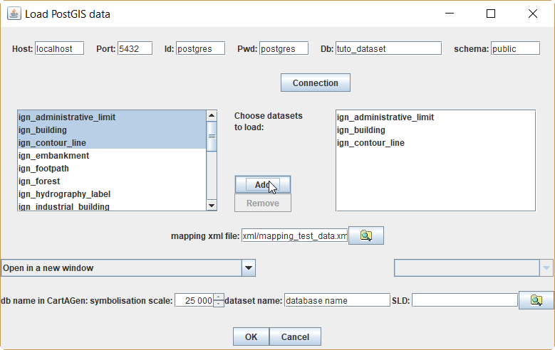
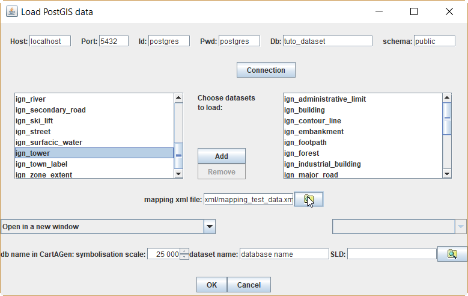
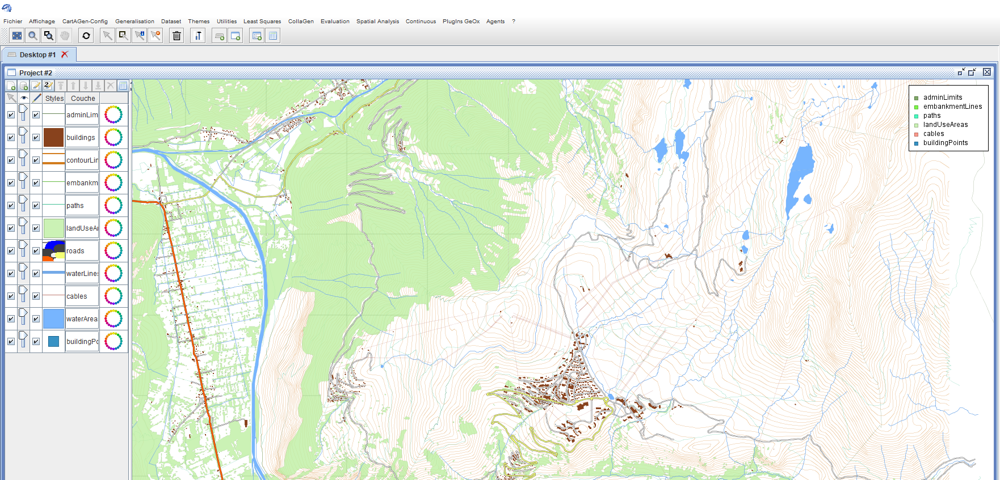

# Tutorial on how to load data in CartAGen


> - Date 20/07/2017.
> - Author: [Guillaume Touya][1]
> - Contact {firstname.lastname}@ign.fr.


Description of the sample dataset
-------------

The test data can be found in the cartagen-appli project [resources][2], alpe_huez_test_data.backup, it is an old extract of IGN (the French National Mapping Agency) data around the skying resort of l'Alpe d'Huez.

This dataset was used in the [EuroSDR generalisation software benchmark][3].


Restoring the sample dataset into PostGIS
-------------
alpe_huez_test_data.backup is a postGreSQL backup, the file has be restored in a postGreSQL database with the postGIS extension. Once restoration is carried, the database contains the following tables:
* ign_administrative_limit: contains the administrative city boundaries.
* ign_building: contains polygon representing the dwelling buildings or buildings of unknown nature. 
* ign_contour_line: contains contour lines representing the terrain with an altitude attribute.
* ign_embankment: 
* ign_footpath:
* ign_hydrography_label:
* ign_industrial_building:
* ign_major_road: contains the most important roads (e.g. highways) represented as centrelines, but with two parallel lines for dual carriageways.
* ign_minor_road:
* ign_orography_label: point labels for orography features (peaks, valleys, passes, etc.).
* ign_public_building: the polygons of public buildings such as town halls or schools.
* ign_river: contains river centrelines with the name as attribute.
* ign_secondary_road:
* ign_ski_lift: ski lift lines.
* ign_street: last category of the road classification of the dataset, the least important roads, e.g. minor streets.
* ign_surfacic_water: polygons of water including large rivers and lakes.
* ign_tower: point features that represent towers or other high features (antenna, etc.).
* ign_town_label: point labels for towns.
* ign_zone_extent: a polygon that marks the boundary of the test dataset. This polygon can be useful to create the road blocks using the faces of the road network graph.

Filling the mapping XML file
-------------
The CartAGen librairies use a [centralized data schema][8] in order to avoid dependencies to specific data schemas in algorithms. 
So the first step load some new dataset in CartAGen is to map the data schema to this centralized schema: that's what the XML mapping file is for.
You can see in the [tutorial on the centralized schema][8] that the schema can have several implementations, and the first part of the mapping file describes the implementation you want to use. Here, the default implementation is chosen (and should be in most cases).

```xml
<mapping>
    <gene-obj-implementation>
    	<name>default</name>
    	<factory>fr.ign.cogit.cartagen.core.defaultschema.DefaultCreationFactory</factory>
    	<root-package-name>fr.ign.cogit.cartagen.core.defaultschema</root-package-name>
    	<root-class>fr.ign.cogit.cartagen.core.defaultschema.GeneObjDefault</root-class>
</gene-obj-implementation>
```

Then, the mapping file is composed of a list of ```xml <matching>``` elements that describe how a table of the postGIS database can be loaded as one of the Java classes of the centralized schema.

```xml
    <matching>
        <postgisLayer>ign_minor_road</postgisLayer>
        <creationMethod>createRoadLine</creationMethod>
        <scaleRef>15000</scaleRef>
        <theme>road</theme>
        <attributes>
            <attribute>
                <postgisAttr>importance</postgisAttr>
                <javaAttr>importance</javaAttr>
            </attribute>
        </attributes>
</matching>
```

The above matching example matches the table "ign_minor_road" to the creation method of the ```java IRoadLine```, that can be found [here][4]. So, the loader will create IRoadLine instances with the lines in the ign_minor_road table.
The ```xml <scaleRef>``` element gives the reference scale of the loaded data.
The ```xml <theme>``` element refers to an ontology concept that matches this type of feature, here, "road". Such ontological concepts were used for instance in the [ScaleMaster 2.0][5]. For now, this ontology reference is not used in CartAGen, but has been added for further interoperability issues.
The ```xml <attribute>``` elements describe mappings between postGIS attributes and the Java fields of the centralized schema. In this example, both datasets have an "importance" attribute that gives the importance of the road in the classification of roads.

The file "mapping_test_data.xml" available in the [resources of cartagen-appli module][6] already contains a complete mapping of the tutorial data, but can be used as a template for future imports with different dataset.

Loading the dataset in the application
-------------
To import the dataset into CartAGen, you have to launch CartAGen by running the class [CartAGenApplicationAgent][11] or [CartAGenApplicationNoAgent][12] depending if you want to use agent-based generalization or not.









Data rendering, as most of the GUI, is based on open source platform [GeOxygene][13], also developed by IGN France. To specify the style of the displayed layers, GeOxygene, and CartAGen, use the SLD/SE standard. See documentations on the [GeOxygene website][13] to learn more on SLD.
By default, i.e. if the field to specify a SLD file is left empty, the loaded data is rendered using a default SLD, that can be found [here][14], that uses a classical topographic mapping style (see figure below).



The dataset can also be imported by code, using the same code as the loading window, that can be found [here][10].

Importing shapefiles
-------------
The tutorial above only allows the import of geographical datasets stored in a PostGIS database. But shapefiles can also be imported in CartAGen, in a slightly different way.


Importing .osm files
-------------

See Also
-------------
- [tutorial on CartAGen centralized schema][8]
- [tutorial to generalize loaded data][9]
- [tutorial to generalize loaded data with agent-based processes][7]


[1]: http://recherche.ign.fr/labos/cogit/english/cv.php?prenom=&nom=Touya
[2]: https://github.com/IGNF/CartAGen/tree/master/cartagen-appli/src/main/resources/data
[3]: http://www.sciencedirect.com/science/article/pii/S0198971509000465
[4]: https://github.com/IGNF/CartAGen/blob/master/cartagen-core/src/main/java/fr/ign/cogit/cartagen/core/genericschema/AbstractCreationFactory.java
[5]: http://www.tandfonline.com/doi/abs/10.1080/15230406.2013.809233
[6]: https://github.com/IGNF/CartAGen/blob/master/cartagen-appli/src/main/resources/xml/mapping_test_data.xml
[7]: /tuto_agents.md
[8]: /tuto_schema.md
[9]: /tuto_generalization_algo.md
[10]: https://github.com/IGNF/CartAGen/blob/master/cartagen-core/src/main/java/fr/ign/cogit/cartagen/core/dataset/postgis/PostGISLoader.java
[11]: https://github.com/IGNF/CartAGen/blob/master/cartagen-appli/src/main/java/fr/ign/cogit/cartagen/appli/core/CartAGenApplicationAgent.java
[12]: https://github.com/IGNF/CartAGen/blob/master/cartagen-appli/src/main/java/fr/ign/cogit/cartagen/appli/core/CartAGenApplicationNoAgent.java
[13]: http://ignf.github.io/geoxygene/
[14]: https://github.com/IGNF/CartAGen/blob/master/cartagen-appli/src/main/resources/sld/CartagenStyles.xml