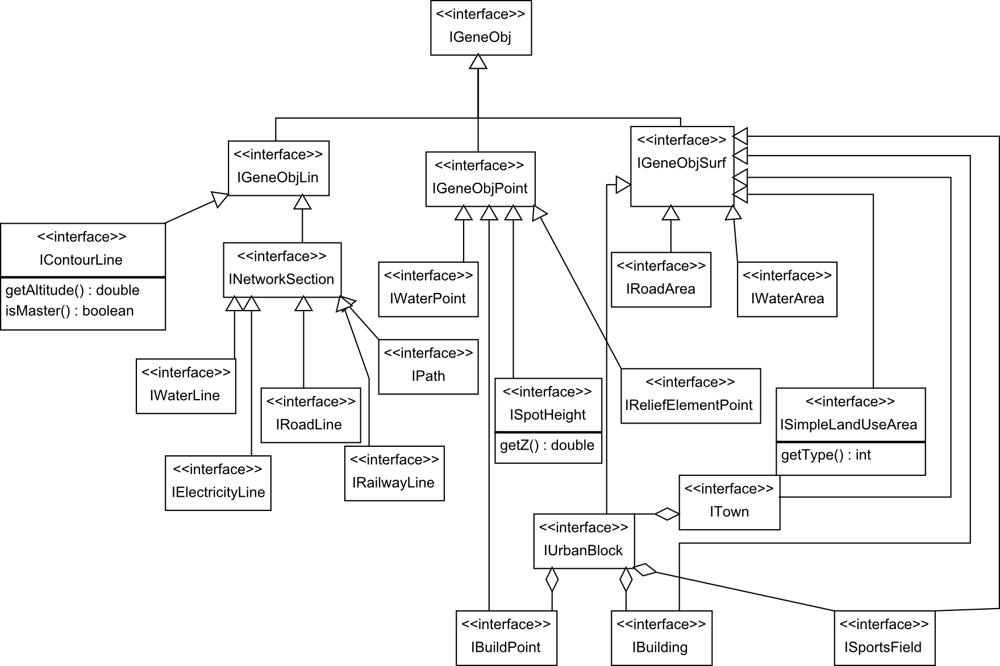
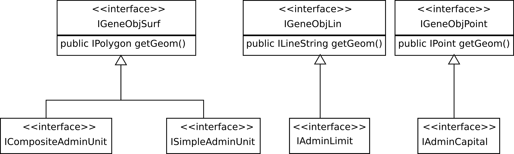
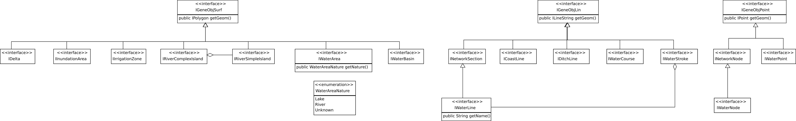
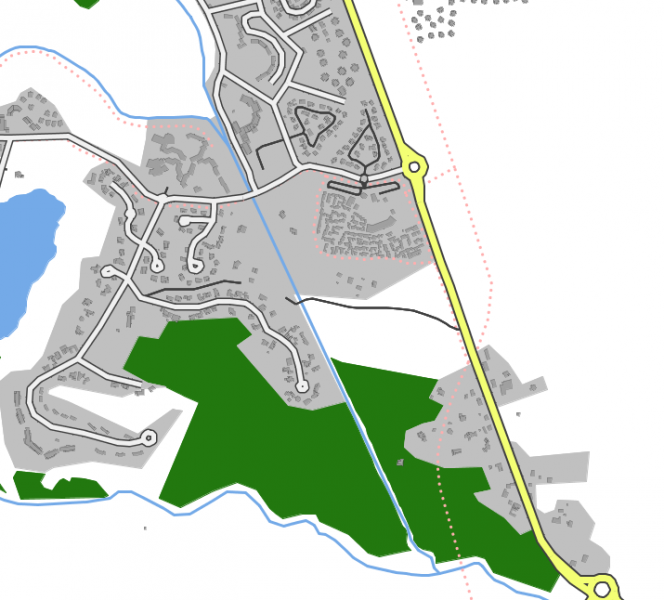

# Understanding CartAGen data schema for generalization
CartAGen uses a centralized data schema to load and generalize geographic information, following the principles of multiple-representation databases (see [Balley et al. 2004][1] for instance). This page explains how it works, describes the content of the centralized schema, and shows how to extend it if necessary.

> - Date 22/06/2017.
> - Author: [Guillaume Touya][1]
> - Contact {firstname.lastname}@ign.fr.


What is CartAGen data schema for generalization?
-------------



Description of the interfaces of the centralized schema
-------------

#### [](#header-4)Administrative schema


#### [](#header-4)Airport schema
[  ](assets/images/airport_schema.png)

#### [](#header-4)Hydrography schema
[  ](assets/images/hydro_schema.png)

Implementations of the centralized schema
-------------
There are two available implementations of the centralized schema:
- [a default one][3] that only implements the interfaces without any additional attribute,
- an OSM implementation that also stores raw tags and OSM metadata on each feature.

How to extend the centralized schema
-------------

This part of the tutorial explains how to extend the centralized schema when a type of feature you want to process does not exist in the schema yet. A use case based on OpenStreetMap (OSM) cycle ways illustrates here the different steps.


### [](#header-3) Add a new interface to the centralized schema

The first step is to check if there is an interface that models cycle ways in the CartAGen centralized schema. Now there is one existing, but let's pretend there is none. 
We want to model cycle ways as a network, so the new interface has to extend the _INetworkSection_ interface. If our new type of feature were a point feature, it would extend _IGeneObjPoint_, _IGeneObjLin_ for line features not structured in networks, and _IGeneObjSurf_ for polygon features.

The code below defines the new interface ICycleWay, whose fields are derived from common characteristics of OSM cycle ways: the cycle way surface and its width (named realWidth here to avoid confusions with the getWidth() method used in CartAGen to retrieve map symbol width).
```java
public interface ICycleWay extends INetworkSection {

  /**
   * The getter for the surface of the cycle way, e.g. "paved" or "asphalt".
   * @return
   */
  public String getSurface();

  public void setSurface(String surface);

  /**
   * The getter for the real or "ground" width of the cycle way, different from
   * the getWidth method inherited from INetworkSection that gives the symbol
   * width.
   * @return
   */
  public double getRealWidth();

  public void setRealWidth(double width);
}
```

### [](#header-3) Implementing the new interface

We've seen above in this tutorial that the CartAGen centralized schema might have several implementations to deal with specific characteristics of some datasets (e.g. the OSM implementation allows to store the raw tags on each feature in addition to the fields already contained in the schema).

In order to actually load cycle ways, there has to be some implementation of the _ICycleWay_ interface in the implementation that you are using (ideally, the interface should be implemented in all centralized schema implementations).
in this use case, we select the OSM implementation and add the following class:

```java
package fr.ign.cogit.geoxygene.osm.schema.roads;

import fr.ign.cogit.cartagen.core.genericschema.network.INetworkNode;
import fr.ign.cogit.cartagen.core.genericschema.road.ICycleWay;
import fr.ign.cogit.geoxygene.api.spatial.coordgeom.ILineString;
import fr.ign.cogit.geoxygene.osm.schema.network.OsmNetworkSection;

public class OsmCycleWay extends OsmNetworkSection implements ICycleWay {

  @Override
  public double getWidth() {
    // TODO Auto-generated method stub
    return 0;
  }

  @Override
  public double getInternWidth() {
    // TODO Auto-generated method stub
    return 0;
  }

  @Override
  public INetworkNode getInitialNode() {
    // TODO Auto-generated method stub
    return null;
  }

  @Override
  public void setInitialNode(INetworkNode node) {
    // TODO Auto-generated method stub
  }

  @Override
  public INetworkNode getFinalNode() {
    // TODO Auto-generated method stub
    return null;
  }

  @Override
  public void setFinalNode(INetworkNode node) {
    // TODO Auto-generated method stub
  }

  @Override
  public String getSurface() {
    // TODO Auto-generated method stub
    return null;
  }

  @Override
  public void setSurface(String surface) {
    // TODO Auto-generated method stub
  }

  @Override
  public double getRealWidth() {
    // TODO Auto-generated method stub
    return 0;
  }

  @Override
  public void setRealWidth(double width) {
    // TODO Auto-generated method stub
  }
```

It can be noticed that our new class extends OsmNetworkSection class that itself extends OsmGeneObj that implements common methods to handle OSM tags and metadata.
So we add the following in the class declaration:

```java
  private String surface;

  @Override
  public String getSurface() {
    return surface;
  }

  @Override
  public void setSurface(String surface) {
    this.surface = surface;
  }

  private double realWidth;

  @Override
  public double getRealWidth() {
    return realWidth;
  }

  @Override
  public void setRealWidth() {
    this.realWidth = width;
  }
```

### [](#header-3) Extended the factory of the chosen implementation

The centralized CartAGen schema is coded following the principles of the [_factory_ design pattern][4]: we do not directly instantiate the implemented classes of the centralized schema, we use a factory to create new objects, the factory using the good implementation. Using this pattern, the generalization code is not dependant on the implementations.
In the use case, the abstract factory needs to contain a createCycleWay(ILineString line) method and the OSM version of the factory extends this method by creating an OsmCycleWay instance, while the default factory creates a CycleWay instance. 

So let's start by adding one (or more) constructors within the OsmCycleWay class:

```java
  public OsmCycleWay(ILineString line) {
    super();
    this.setGeom(line);
  }
```

Then, add the method that could use this constructor in the abstract factory (AbstractCreationFactory in package fr.ign.cogit.cartagen.core.genericschema) :

```java
  @SuppressWarnings("unused")
  public ICycleWay createCycleWay(ILineString line) {
    AbstractCreationFactory.logger
        .error("Non implemented creation factory method for ICycleWay");
    return null;
  }
```

Then override this method in the OSM implementation factory (fr.ign.cogit.cartagen.osm.osmschema.OSMSchemaFactory) :

```java
  @Override
  public ICycleWay createCycleWay(ILineString line) {
    return new OsmCycleWay(line);
  }
```

There is a final step, specific to OSM implementations because .osm files do not order, or classify the map features: a generic method that invokes the good factory method as to be completed with the case of a feature whose tags match with cycle ways.

```java
	public OsmGeneObj createGeneObj(Class<?> classObj, OSMResource resource,
			Collection<OSMResource> nodes) {
		if (IRoadLine.class.isAssignableFrom(classObj)) {
			ILineString line = OsmGeometryConversion.convertOSMLine(
					(OSMWay) resource.getGeom(), nodes);
			return (OsmGeneObj) this.createRoadLine(line, 0);
		}

		...

	        if (ICycleWay.class.isAssignableFrom(classObj)) {
                        ILineString line = OsmGeometryConversion
                          .convertOSMLine((OSMWay) resource.getGeom(), nodes);
                         return (OsmGeneObj) this.createCycleWay(line);
                }
		// TODO
		return null;
	}
```

### [](#header-3) Creating a dedicated population in the dataset 

In order to be stored and displayed in CartAGen, the features of the centralized schema have the be added in a dedicated population of features, the populations being stored in a _CartAGenDataset_ instance. Each interface of the centralized schema has a dedicated population in the dataset and the name of the population is standardized as a static field in the CartAGenDataset class.
Four additions are necessary in the _CartAGenDataset_ class:

* add the population name as a static field :

```java
public class CartAGenDataSet {

	// ///////////////////////////////////////
	// STANDARD NAMES OF DATASET POPULATIONS
	// ///////////////////////////////////////

	public static final String TREE_POINT_POP = "trees";
	public static final String CYCLEWAY_POP = "cycleWay";
```


* Complete the getPopNameFromObj(IFeature obj) method by adding the following condition:

```java
    if (obj instanceof ICycleWay) {
      return CartAGenDataSet.CYCLEWAY_POP;
    }
```

* Complete the getPopNameFromClass(Class<?> classObj) method by adding the following condition:

```java
    if (ICycleWay.class.isAssignableFrom(classObj)) {
      return CartAGenDataSet.CYCLEWAY_POP;
    }
```


* Finally, add a new shortcut method that allows a direct access to the cycle way features:

```java
  /**
   * Gets the cycleways of the dataset
   * 
   * @return
   */
  @SuppressWarnings("unchecked")
  public IPopulation<ICycleWay> getCycleWays() {
    return (IPopulation<ICycleWay>) this.getCartagenPop(
        CartAGenDataSet.CYCLEWAY_POP, ICycleWay.FEAT_TYPE_NAME);
  }
```

### [](#header-3) Displaying the new features





[1]: http://www.tandfonline.com/doi/abs/10.1080/13658810410001672881
[2]: https://github.com/IGNF/geoxygene
[3]: https://github.com/IGNF/CartAGen/tree/master/cartagen-core/src/main/java/fr/ign/cogit/cartagen/core/defaultschema
[4]: https://en.wikipedia.org/wiki/Factory_method_pattern
