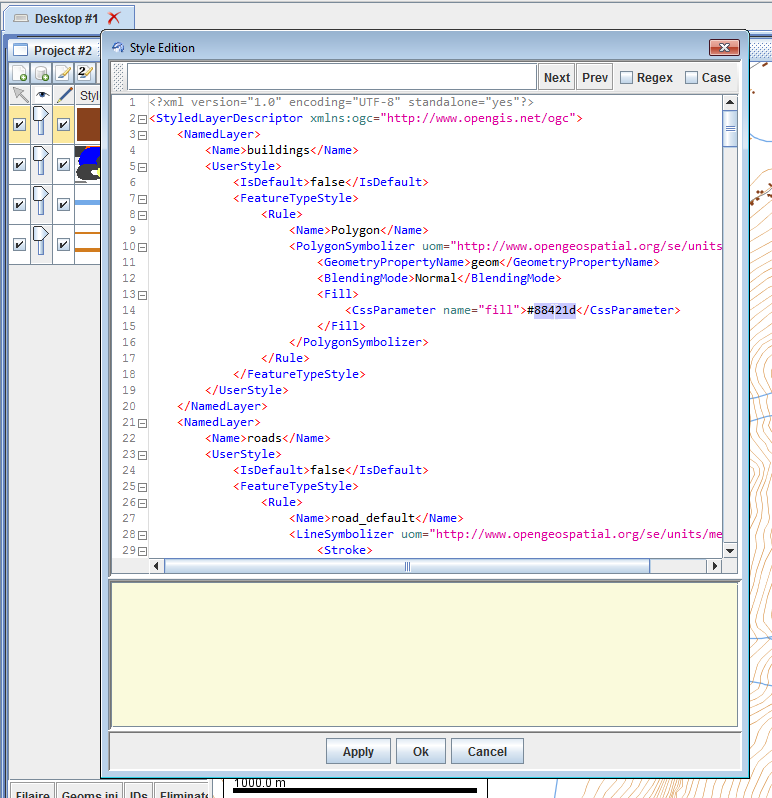

# Tutorial to use the CartAGen/GeOxygene SLD/SE symbolization system
This tutorial explains how to use the CartAGen symbolization system based on the SLD/SE OGC standard.

> - Date 23/07/2018.
> - Author: [Guillaume Touya][1]
> - Contact {firstname.lastname}@ign.fr.

The SLD/SE OGC standard
-------------
[Symbology Encoding][3] (SE) is a XML language for styling information that can be applied to digital geographic information. [Styled Layer Descriptor][2] is a specialization of the SE standard for WMS services, even if it is often stated as the core standard compared to SE.

SLD/SE is used in several mainstream open source GIS software such as QGIS or GeoServer, and is also implemented in GeOxygene open source research Java platform, on which CartAGen is based.

CartAGen/GeOxygene implementation of the standards
-------------
CartAGen uses the GeOxygene Java implementation of the standards, and you can find the code in the [GeOxygene Github repository][7]. This implementation is composed of Java classes that model a StyledLayerDescriptor, an XML model to store the files and reuse them in multiple sessions, and rendering methods that are able to render the StyledLayerDescriptor in the GUI.

You can find two tutorials in French (but figures and the code can be understood by English readers) on the GeOxygene implementation of the standards, [here][5] and [here][6].
Be careful, the GeOxygene implementation of SLD/SE is slightly different than the ones for GeoServer or QGIS for instance. You cannot directly use a GeoServer SLD file in CartAGen, and conversely.

What does a SLD file look like?
-------------

The example below shows the structure of a SLD file, the comments in the code explain the role of each line. You can find several examples of SLD files in the Github repository, for instance [here][4].

```xml
  <NamedLayer>
    <Name>cycleWay</Name> <!-- this name corresponds to the layer name, i.e. the
    name of the CartAGen population that is displayed in this layer (CartAGenDataSet.CYCLEWAY_POP in this case) -->
      <UserStyle>
        <FeatureTypeStyle>
          <Rule><!-- a feature type style may have different rules to apply different symbols to different features (e.g. minor roads vs. major roads) -->
            <Filter><!-- a filter that defines what features of the layer apply
            to this specific rule -->
              <PropertyIsEqualTo><!-- only the features with the attribute 'highway' = 'cycleway' have the following symbol  -->
              <PropertyName>highway</PropertyName>
               <Literal>cycleway</Literal>
              </PropertyIsEqualTo>
            </Filter>	 	
          <LineSymbolizer><!-- a line symbolizer is used here as the features are lines. Point, polygon, and text symbolizers also exist -->
            <Stroke><!-- defines the characteristics of the "stroke" component of the symbol -->
              <CssParameter name="stroke">#D391BE</CssParameter><!-- stroke color in RGB -->
              <CssParameter name="stroke-width">2.0</CssParameter><!-- stroke width in pixels -->
              <CssParameter name="stroke-linejoin">round</CssParameter><!-- type of stroke line join -->
              <CssParameter name="stroke-linecap">round</CssParameter><!-- type of stroke line cap -->
              <CssParameter name="stroke-dasharray">6 3</CssParameter><!-- characteristics of the dashes in the line (length of dash in pixels and then length of space in pixels) -->
            </Stroke>
          </LineSymbolizer>          	
        </Rule>  
      </FeatureTypeStyle>		  
    </UserStyle>
  </NamedLayer>
```


How to change the symbols of the map?
-------------

There are three ways to change the symbols in the map: using the styling GUI, editing the SLD of the map, and loading a new SLD file.

#### [](#header-4)Styling GUI

The first and simplest way to change the symbols of the map is to use the styling GUI (see image below), that appears when the user right clicks on a layer in the layer view panel on the left of the GUI, and then clicks on "Editer le style" in the pop-up menu.


Be aware that all the possible options for a line, polygon, point, or text symbol are not implemented in this GUI (dashes for instance). But it is quite easy to change a color or the width of a stroke.

#### [](#header-4)Editing the SLD

The second way to change the symbols is to directly edit the StyledLayerDescriptor feature in a XML format (see image below). The user has to right click on a layer in the layer view panel on the left of the GUI, and then to click on "Editer le SLD" in the pop-up menu. Then, the user writes the XML code that corresponds to the symbol change and applies the modification.



#### [](#header-4)loading a new SLD file
If we want to use on our map layers a style that was previously stored in a SLD file, the easiest way is to load this SLD file using the button in the left panel above the layer list (see Figure below).


[1]: http://recherche.ign.fr/labos/cogit/english/cv.php?prenom=&nom=Touya
[2]: http://www.opengeospatial.org/standards/sld
[3]: http://www.opengeospatial.org/standards/se
[4]: https://github.com/IGNF/CartAGen/tree/master/cartagen-appli/src/main/resources/sld
[5]: http://ignf.github.io/geoxygene/documentation/tutorial/motif.html
[6]: http://ignf.github.io/geoxygene/documentation/tutorial/contour.html
[7]: https://github.com/IGNF/geoxygene/tree/master/geoxygene-style/src/main/java/fr/ign/cogit/geoxygene/style
